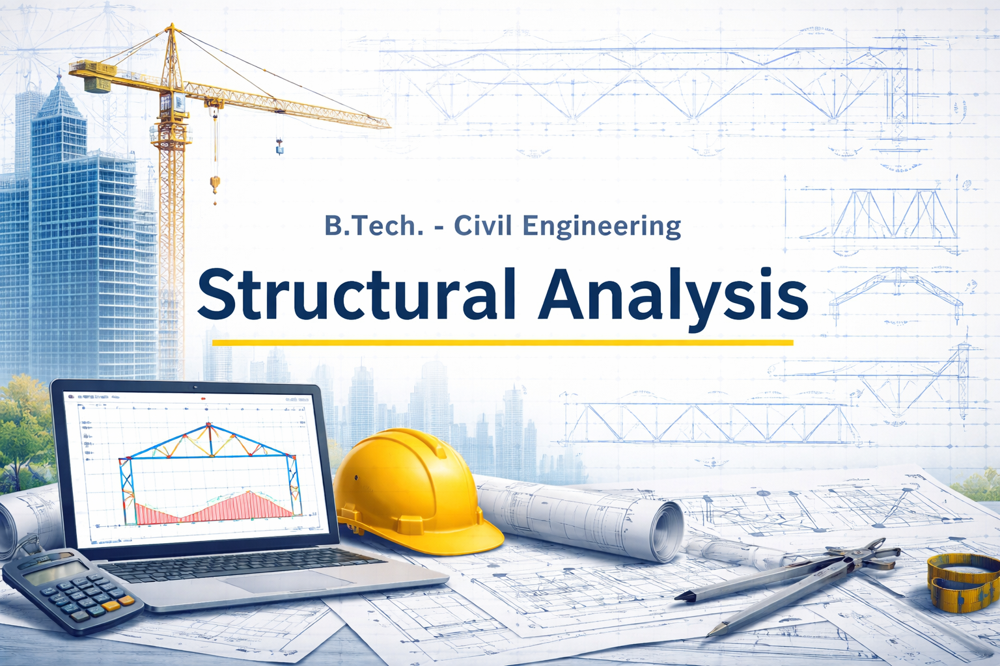

# Structural Analysis - I

| **[Contents](Contents/Content.md)** | **[Syllabus](Contents/Syllabus.md)** | **[Tutorial Sheets](Contents/Tutorial_Sheets.md)** | **[Assignments](Contents/Assignments.md)** | **[Contact](Contents/Contact.md)** | 

🚨 **New Tutorial Sheets are now available. For details on due dates and submission instructions — [Click Here](Contents/Tutorial_Sheets.md)**

  

---

*Disclaimer: All rights and credits reserved to the respective owner(s) of the uploaded content/images. The uploaded content is solely for educational purpose. If you are the main copyright owner, contact to claim credit or content removal.*

---
